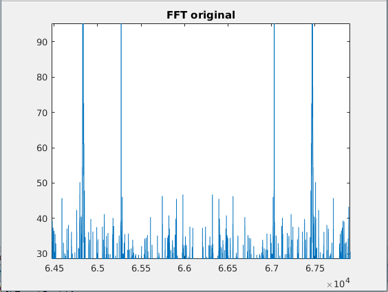
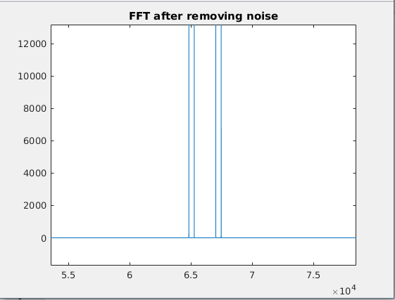

## Problem 2

In this problem, you are given a file q2.mat with signal X and the sampling frequency, Fs. The signal consists of the sound played by a particular key of a two tone telephone. Your task is to find out the frequencies of this particular key, and clean the noisy signal as best as you can.

### Solution
- Convert the loaded signal into frequency domain by using the inbuilt matlab function 'fft'.
- Shift the fft using fftshift function.
- Find the frequencies present in the dialpad using the fft.
- Make the band pass filter
- Multiply the original signal with the filter and convert it back to time domain and noises are filtered.

