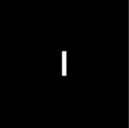
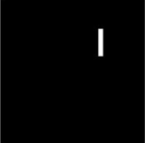

## Problem 4

In this problem, write need to write observations on doing FFT over the images Img1a.png, Img1b.png, Img2a.png, Img2b.png in the report and also write a MATLAB code to remove noise from Img3.png.

### Img1A.png and Img1B.png

| Image          | FFT of the Image     |
| -------------- | -------------------- |
|  |  |
|  |  |

### Observations
- Both the images have same fft as fftshift operation is applied to the images fft.
- Travelling in the horizontal direction gives very small change in the frequency as compared to the vertical direction. Hence vertical stripes have more distance between them as compared to the horizontal ones.

### Img2A.png

| FFT2 Magnitude of Image2A | Log(FFT2 Magnitude) of Image2A |
| ------------------------- | ------------------------------ |
|         |          |

### Observations
- The logarithmic transform of the Fourier shows that the image contains many minor frequencies. The main reason is that a diagonal can only be approximated by the square pixels of the image, hence, additional frequencies are needed to compose the image.

### Img2B.png

| FFT2 Magnitude of Image2B | Log(FFT2 Magnitude) of Image2B |
| ------------------------- | ------------------------------ |
|         |          |

### Observations
- The frequency components (the significant ones that contribute to the image) are accumulated in the center.

### Filtering noise in the last image
- First convert the image in the frequency domain.
- We find the white edges in the fft as the original image contains horizontal and vertical white lines.
- We make the filter in such a way that the these white lines are removed but not from the center part.
- After applying the filter convert the image back to the time domain.

​                                                                              **Noised Image**

​										**Denoised Image**

